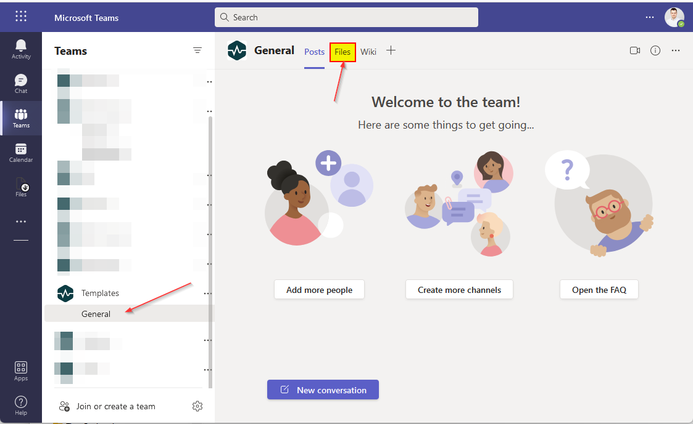
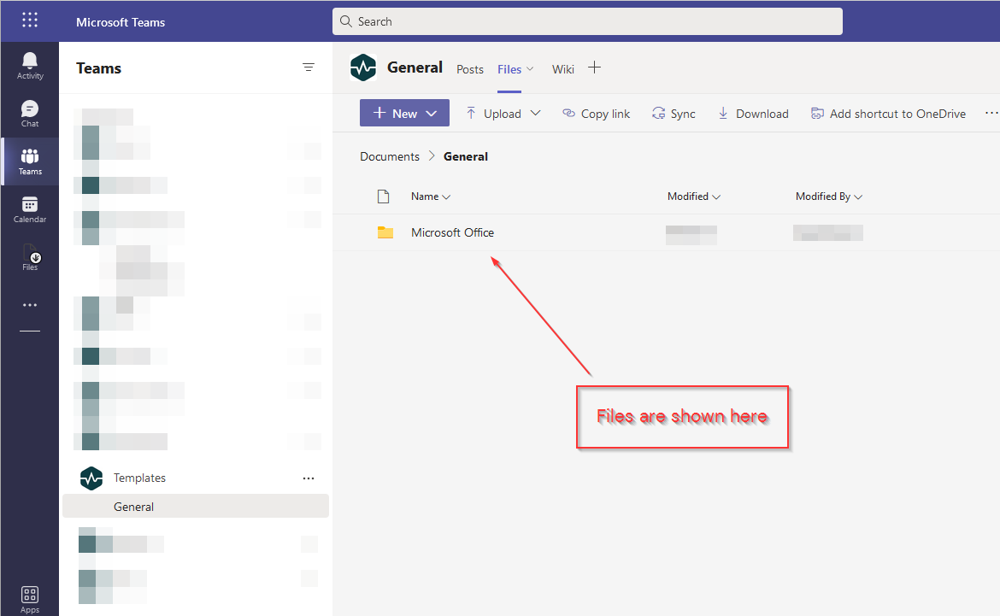
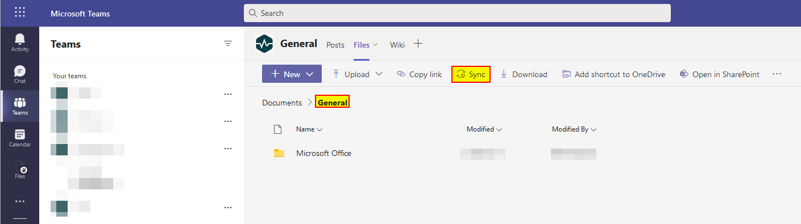

# Access files through Microsoft Teams

Files are accessible through Microsoft Teams which has an Integration with SharePoint. This will show you how to access files through Microsoft Teams.

1. Open a browser and navigate to "**https://teams.microsoft.com/**" or download and install the application from "[**https://www.microsoft.com/en-us/microsoft-teams/download-app**](https://www.microsoft.com/en-us/microsoft-teams/download-app)".

2. Click on "**General**" under a team, and then click on "**Files**". If you don't see any teams, that means that you don't have the correct permissions.

   

3. You will now see folders and files if any.

   

4. (Optional) It's also possible to add the file share to File Explorer (Windows) and Finder (macOS) if you have OneDrive for Business installed. In the root folder *General* click on "**Sync**".

   
