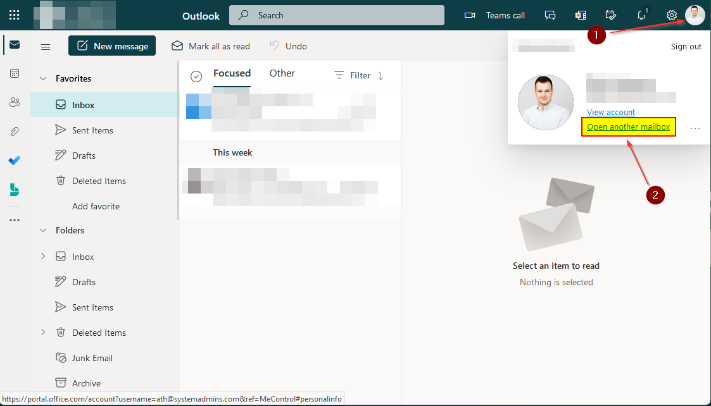
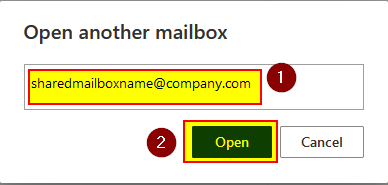
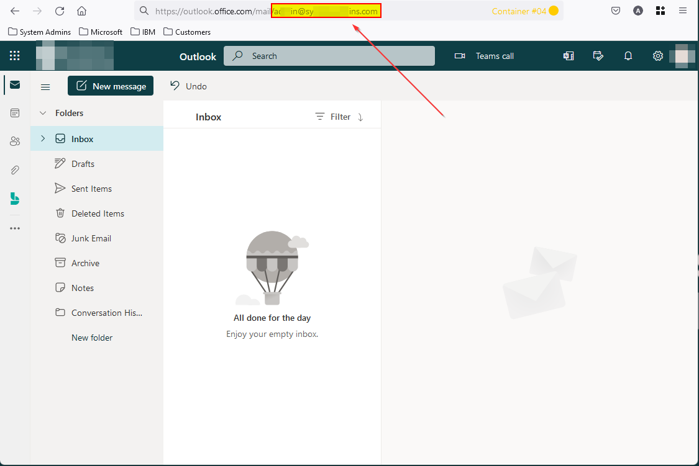

# Access shared mailbox through Outlook (OWA) webmail

This will show how to access a shared mailbox through Outlook (OWA) webmail.

1. Open a browser and navigate to "**https://outlook.office.com/mail**".

2. It will now prompt you for credentials, enter your e-mail account and click "**Next**".

   

3. Enter the password associated with your email address (Microsoft 365 account) and click "**Sign in**".

   

4. Depending on your MFA validation, accept the challenge. In the example, we are using Microsoft Authenticator.

   

5. You will be redirected to the Outlook webmail. Click on the profile picture in the top right corner and then click on "**Open another mailbox**".

   
   
6. Now write the e-mail of the shared mailbox you want to access and click "**Open**".

   

7. You will now get redirected to the shared mailbox, you can verify that you are in the correct account by checking the URL. The shared mailbox e-mail will be in plaintext like "https://outlook.office.com/mail/**mysharedmailbox@company.com**".

   

   
