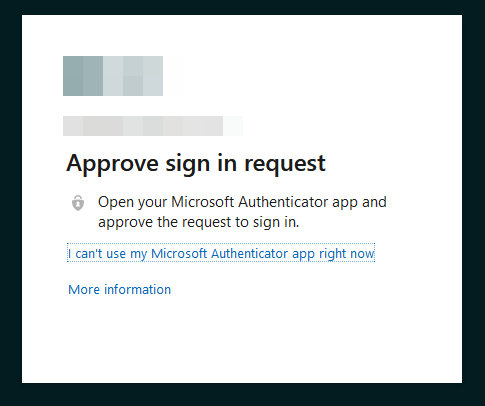

# Access webmail through Microsoft 365

This will show how to access Outlook (OWA) webmail through Microsoft 365. Your company account needs at least an [Exchange Online Plan 1 license](https://www.microsoft.com/en-us/microsoft-365/exchange/exchange-online?market=dk) applied. Depending on company policy webmail can be blocked.

1. Open a browser and navigate to "**https://outlook.office.com/mail**".

2. It will now prompt you for credentials, enter your e-mail account and click "**Next**".

   

3. Enter the password associated with your email address (Microsoft 365 account) and click "**Sign in**".

   

4. Depending on your MFA validation, accept the challenge. In the example, we are using Microsoft Authenticator.

   

5. You will be redirected to the Outlook webmail.

   

