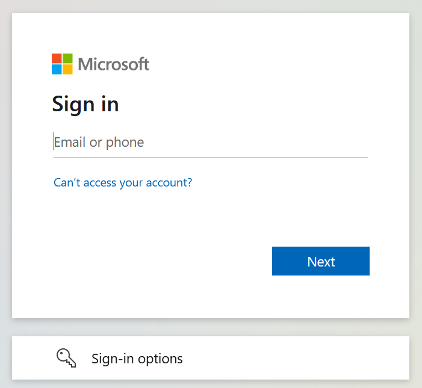
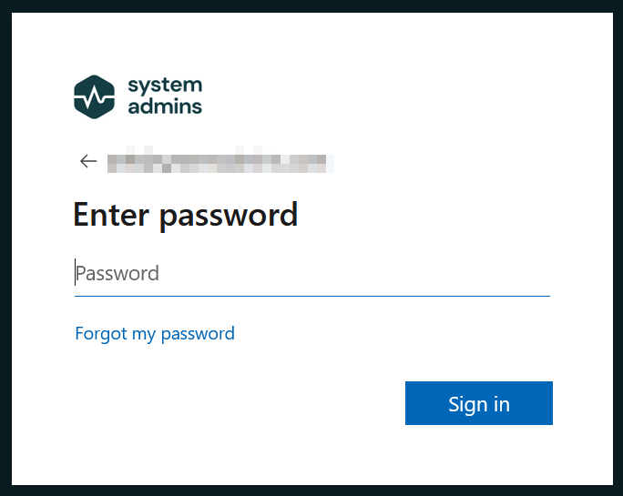
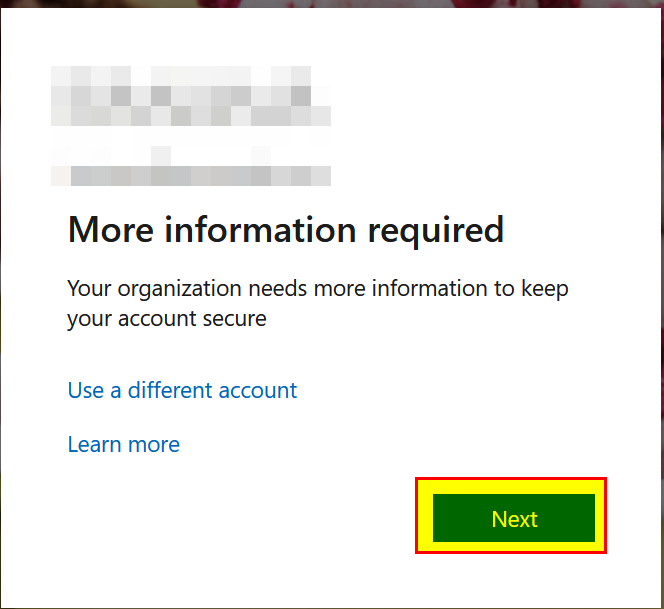
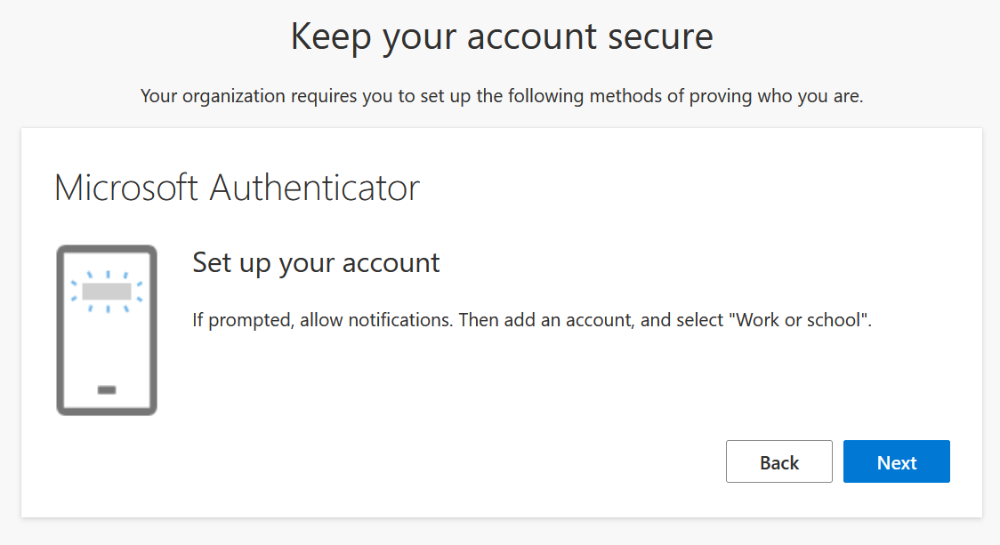
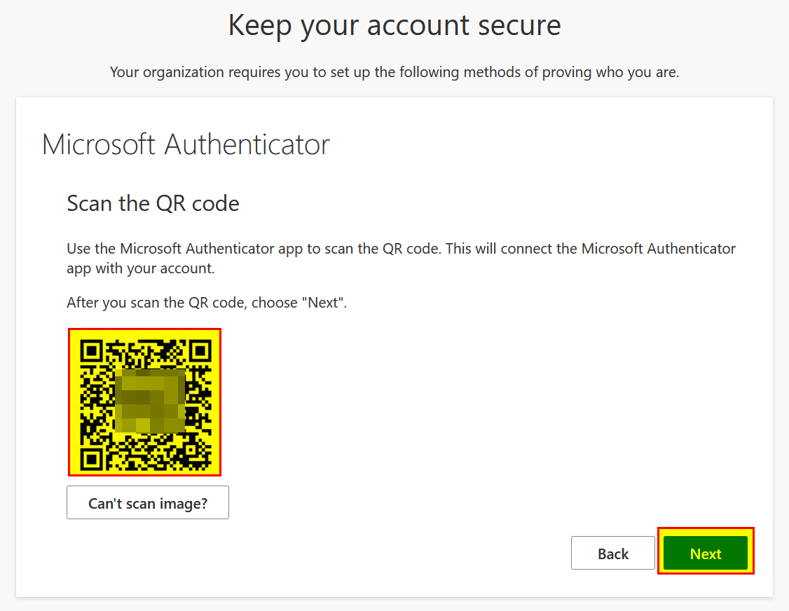
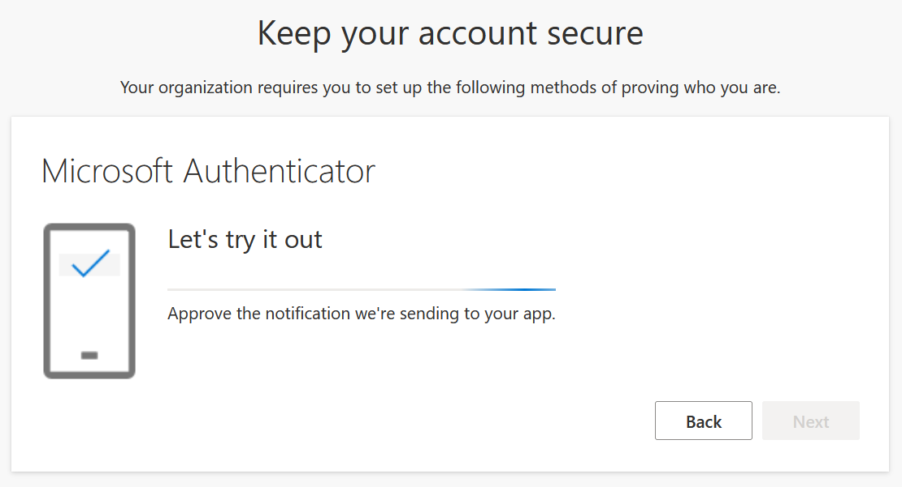
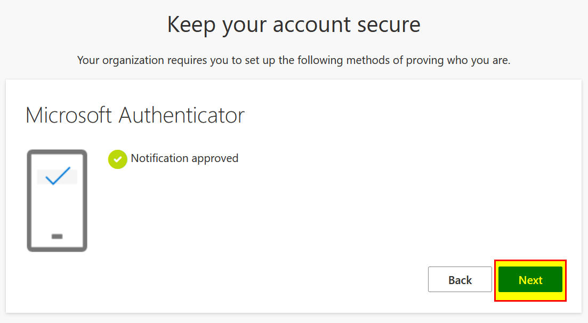
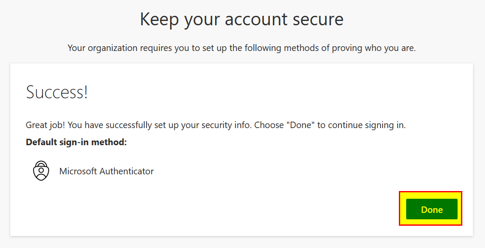
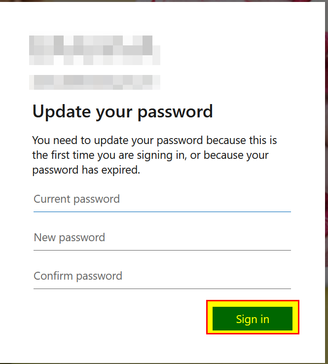

# First login to Microsoft 365

This guide will help you with the first login to Microsoft 365. Verify that you have

- Access to a computer with internet access
- Access to a smart phone (Android or iOS) with internet access
- A username and password from your IT-department to Microsoft 365

When the above requirements is fulfilled, please proceed by:

1. Open a browser on your computer and navigate to "**https://portal.office.com**".

2. Enter the company e-mail address and click "**Next**".

   

3. Now enter the password and click "**Sign in**".

   

4. Click on "**Next**".

   

5. Now on your phone install "**Microsoft Authenticator**" from the app store. It's also possible to download the app through the following link:

   https://aka.ms/getMicrosoftAuthenticator

6. Open the "**Microsoft Authenticator**" app on the phone, and click "**Next**".

   (the above step can be skipped if you have used the app before)

7. In the "Microsoft Authenticator" app on your phone, if you get prompted, then allow notifications. Then add an account (by the "**+**" button in the top right corner), and select "**Work or school**".

8. Back on the computer click "**Next**".

   

9. Back on your phone click on "**Scan QR code**" and scan the barcode on the computer. After you have scanned the code, click "**Next**" on the computer.

   

10. On your phone, allow the notification in the "**Microsoft Authenticator**" app.

   

11. When the notification is approved, back on the computer click "**Next**".

    

12. Now click on "**Done**".

    

13. Now you need to change your password, fill out the fields and click "**Sign in**".

    
