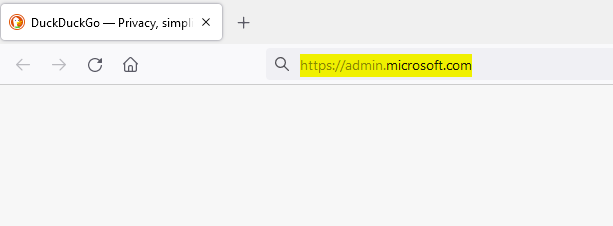
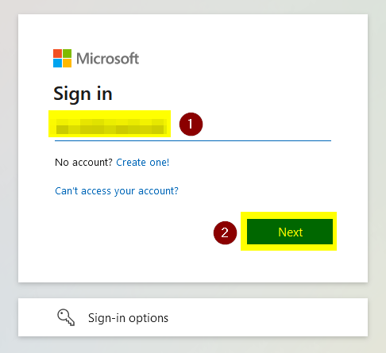
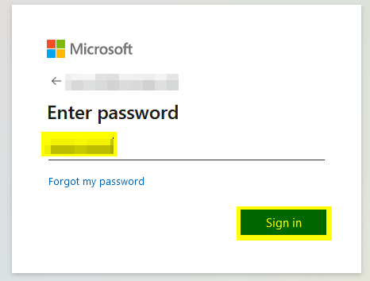
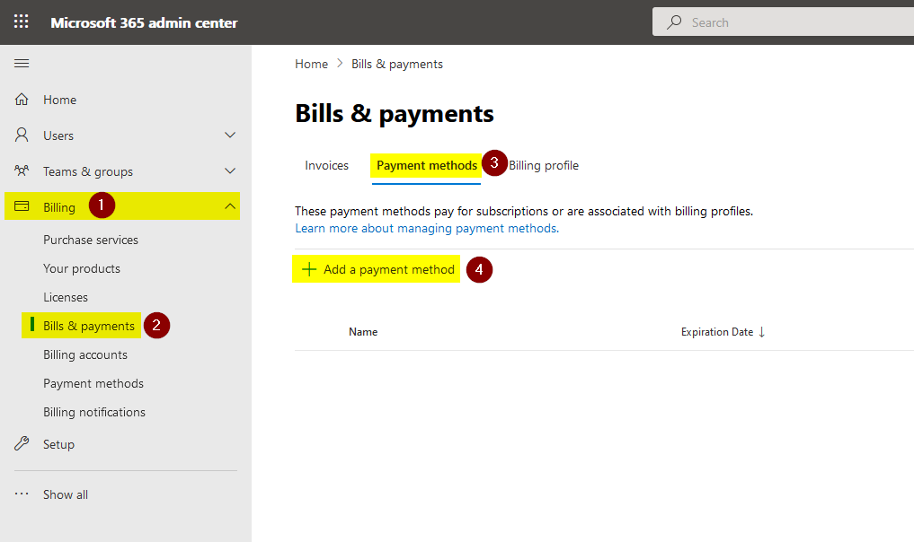
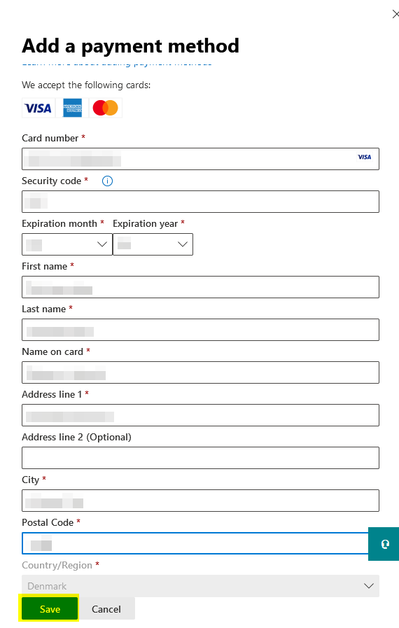

# Add payment method in Microsoft 365

This will show how-to setup an credit card as a payment method in Microsoft 365. You need to be a billing or global administrator in Microsoft 365 before you can follow this guide.

1. Open a browser (Chrome, Firefox, Edge etc.) and navigate to "**https://admin.microsoft.com**".

   

2. Type the e-mail address of the user (such as *myuser@contoso.com*) and click on "**Next**".

   

3. Enter the password for the account and click on "**Sign in**".

   

4. Expand "**Billing**", click "**Bills & payments**", choose the "**Payment methods**"-tab, and then click on "**Add a payment method**".

   

5. Now enter the credit card details and click on "**Save**".

   