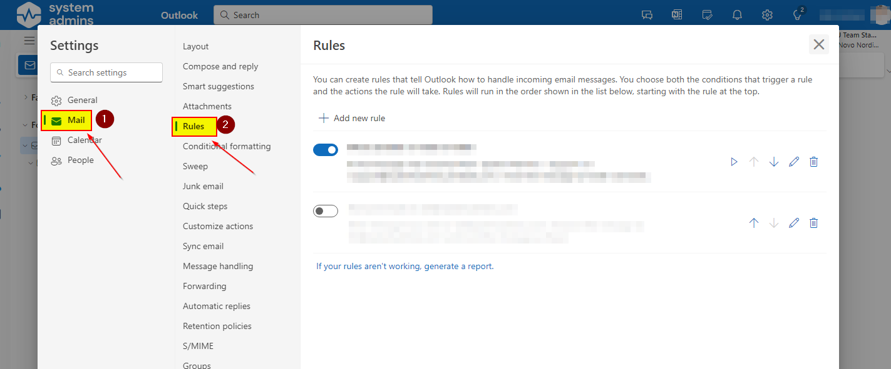

# Edit a mailbox rule in Outlook through webmail

This will show how you can add/remove/update a mailbox rule through Outlook (OWA) webmail.

1. Open a browser and navigate to "**https://outlook.office.com/mail**".

2. In the top right corner click on the cog.

   

3. In the settings section, click on "**Mail**" and then "**Rules**".

   

4. You now have three options, which is add a new rule, update an existing rule or remove a rule.

   

5. In this example we are going to update an rule, but the same applies to creating a new rule (same wizard). Click on the pencil icon for a rule.

   

6. Now make the changes to the rule, in this example we are going to add a e-mail address to a forward rule. Then click "**Save**".

   

