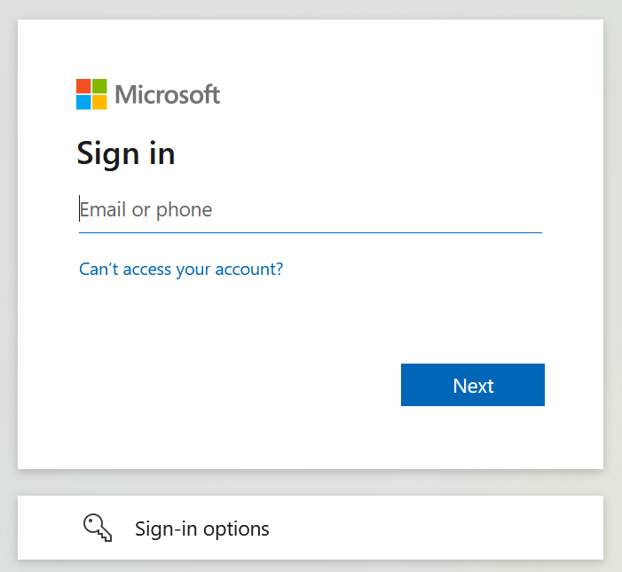

# Enroll account in Microsoft Authenticator (MFA)

Microsoft Authenticator is a two-factor authentication program that provides added security to your online account in the form of an app. You can follow these steps to add your two-factor verification (MFA) and password reset methods in Microsoft 365.

1. Open a browser on your computer and navigate to "**https://myaccount.microsoft.com**".

2. Enter the company e-mail address and click "**Next**".

   

3. Now enter the password and click "**Sign in**".

   

4. Click on "**Security Info**".

   

5. Press "**Add sign-in method**".

   

6. Select "**Authenticator app**" and click "**Next**".

   

7. Phone: Now download the "**Microsoft Authenticator**" app to your phone from the App store or visit the following website on your phone.

   https://aka.ms/getMicrosoftAuthenticator

8. Phone: After you have installed the app on your phone, open the app and click "**Next**".

9. Phone: If prompted allow notifications. Then add an account, and select "**Work or school**" (click on the "**+**" sign in the top right corner).

10. Now back on your computer click on "**Next**" two times.

    

    

11. Phone: Now scan the QR code within the Microsoft Authenticator app. When the QR code is scanned click on "**Next**" on the computer.

    

12. Phone: Approve the notification in the Microsoft Authenticator in your app. Then click "**Next**" on your computer.

    

13. You have now associated the Microsoft Authenticator with your Microsoft 365 account.

