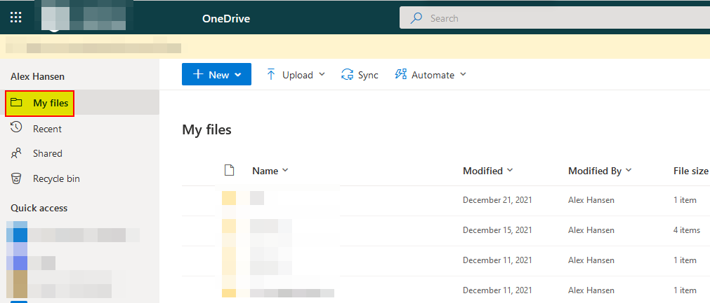
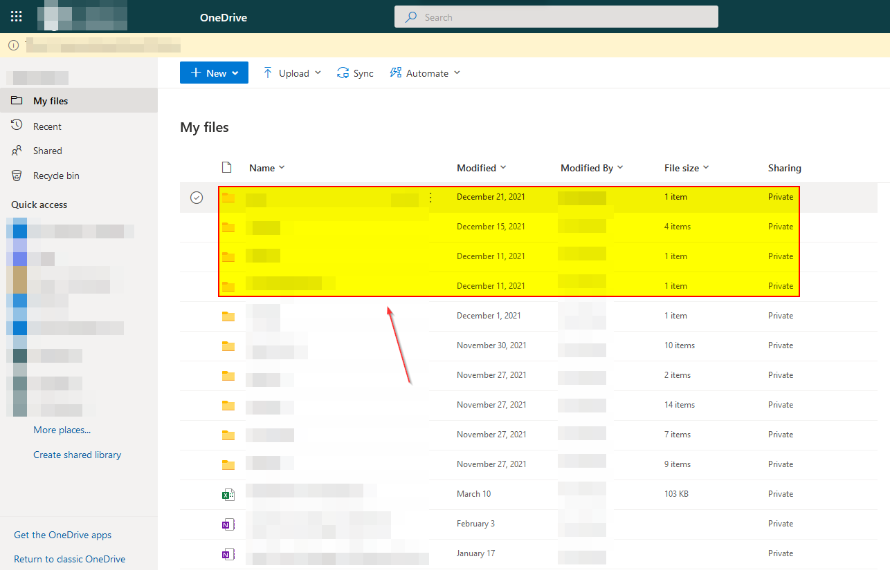

# Access personal files through OneDrive for Business

Personal company files are accessible through OneDrive for Business. This will show you how to access those files.

1. Open a browser and navigate to "**https://tenant-my.sharepoint.com**".

2. Use your company credentials to log in.

3. Click on "**My files**".

   

4. You are now able to see all your files.

   

   

