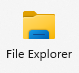
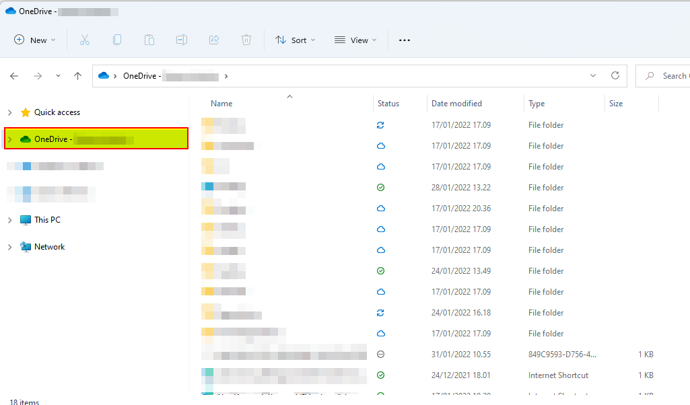
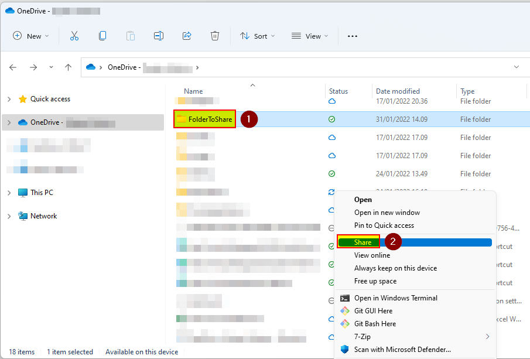
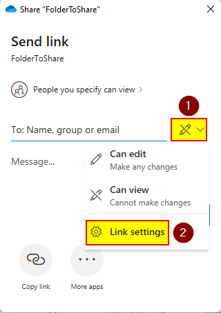
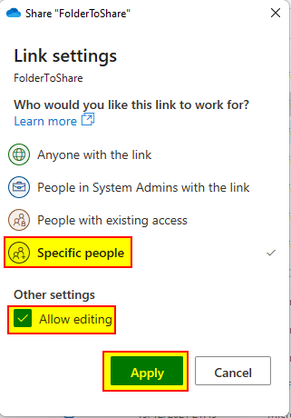
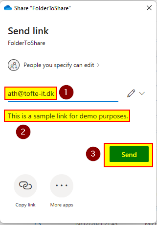
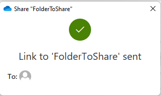
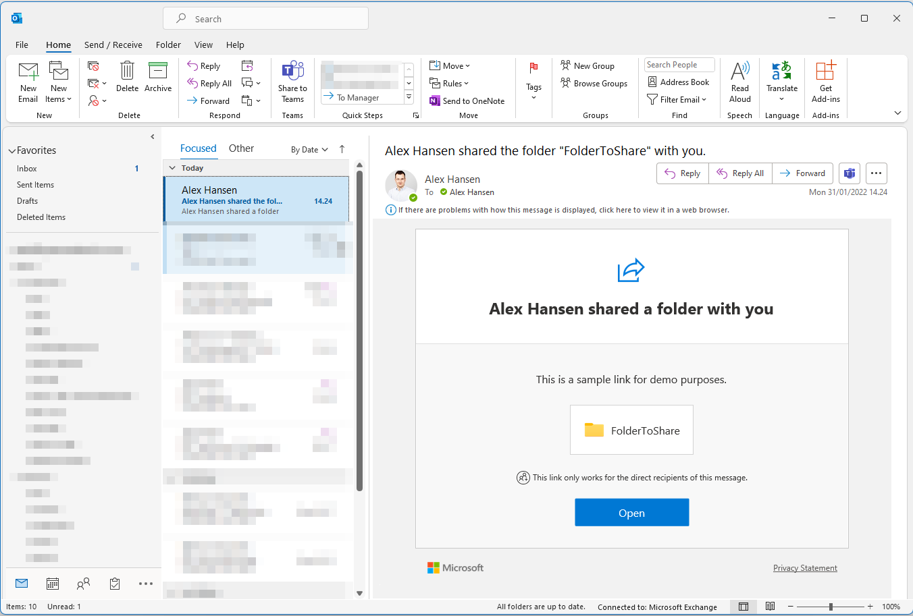

# Share files and folders with Microsoft OneDrive

This will demonstrate how to share files and folders through Microsoft OneDrive in Windows. The following screenshot is from Windows 11 (build 22000.318)

**Make sure that:**

- [ ] You have internet connectivity.
- [ ] Have license to Microsoft OneDrive for Business.
- [ ] Installed OneDrive on your device (comes with Microsoft Office).

**How-to:**

1. Open "**File Explorer**".

   

2. Navigate to your OneDrive folder by clicking on "**OneDrive - ........**".

   

3. Right click on the folder or file you want to share and then click on "**Share**" (if you are using Windows 11, hover "OneDrive" and then "**Share**").

   

4. Depending on your security settings you now have a few options to consider, like:

   - Should the folder be editable?
   - Show the sharing expire?
   - Should the sharing be password protected?
   - Should the item be public available or to a specific recipient?

   In this example we will share a folder which be to a specific recipient that is editable.

   Click on the pencil and choose "**Link settings**".

   

5. Choose "**specific people**", checkmark "**Allow editing**", and click on "**Apply**".

   

6. Now type an e-mail who should receive the link such as "**alex@contoso.com**", then click on "**Send**".

   

7. The link is now send to the recipient.

   

8. Here is a example of the message the recipient receives through e-mail.

   

