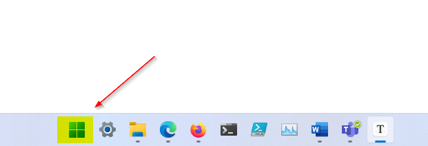
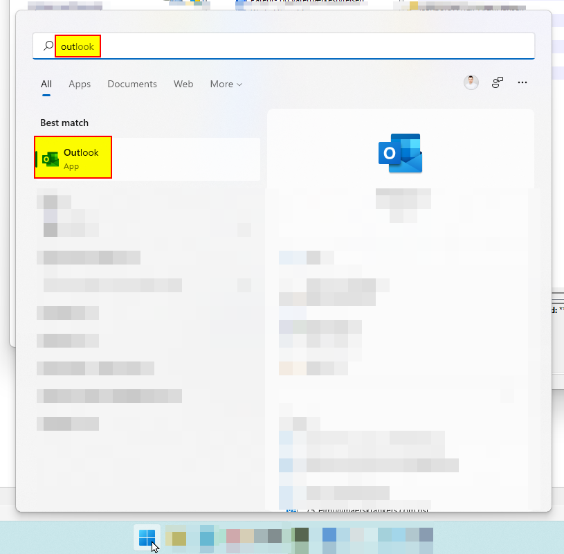
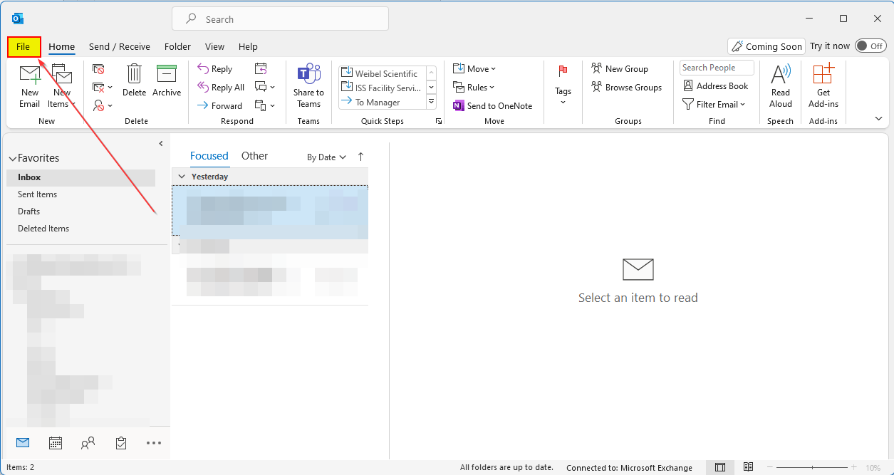
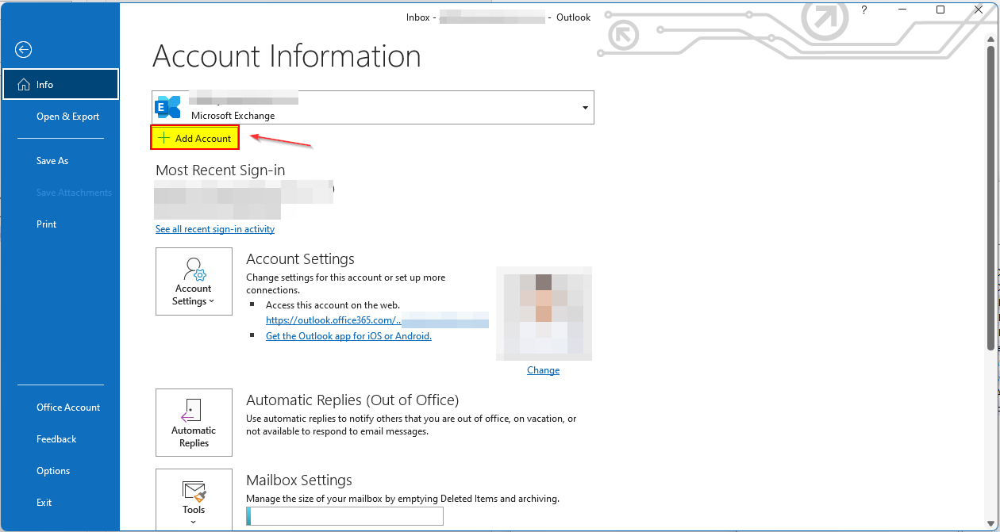
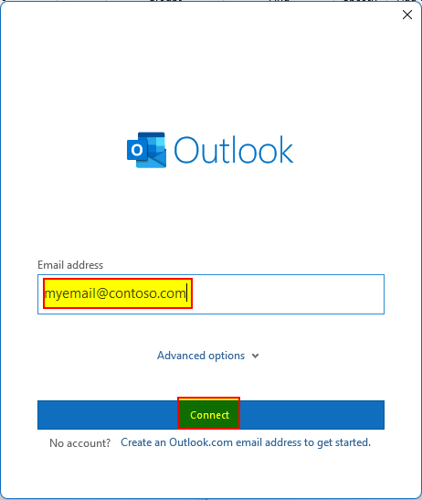
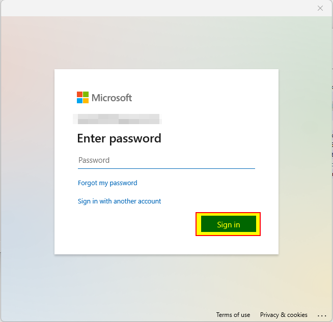
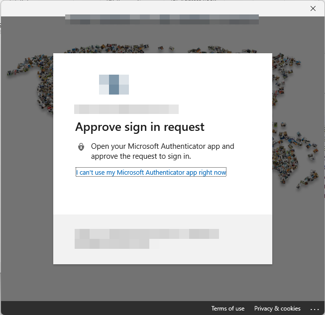
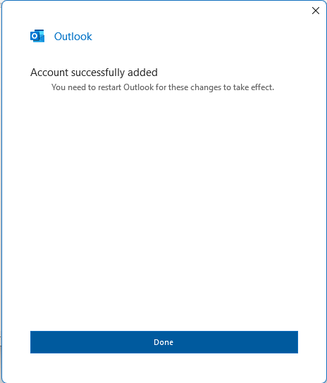

# Add in Microsoft Outlook in Windows

This will explain how to add a mailbox in Microsoft Outlook on Windows. The following screenshot is from Windows 11 (build 22000.318)

1. Click on "**Start**" (Windows icon) on the desktop.

   

2. Type and click on "**Outlook**".

   

3. If you haven't configured an account in Outlook before, you can go to step 5. Otherwise, click on "**File**" in the top left corner.

   

4. Click on "**Add Account**".

   

5. Now type your e-mail address and click on "**Connect**".

   

6. Type the password of the email account and click "**Sign in**".

   

7. If there is MFA enabled on the account, please approve the challenge.

   

8. Click on "**Done**".

   

9. Now close Outlook and re-open it.

