# Add shared mailbox in Microsoft Outlook

This will explain how-to add and shared or additional mailbox to your Microsoft Outlook profile. The following screenshot is from Windows 11 (build 22000.318)

1. Click on "**Start**" (Windows icon) on the desktop.

   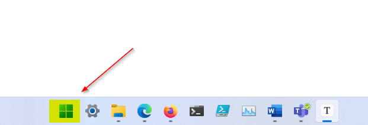

2. Type and click on "**Control Panel**".

   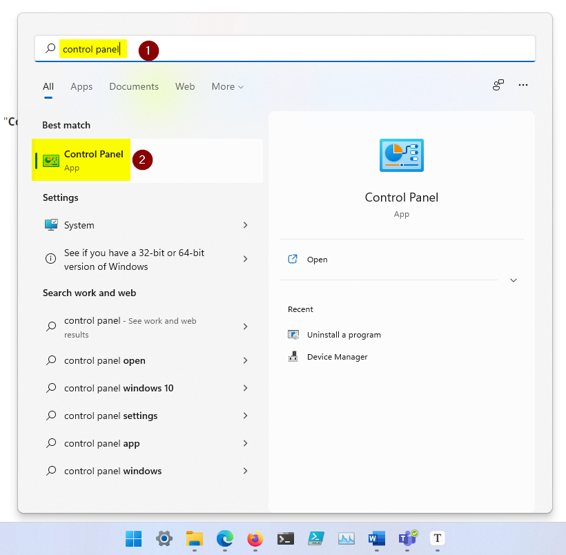

3. Click on "**User Accounts**".

   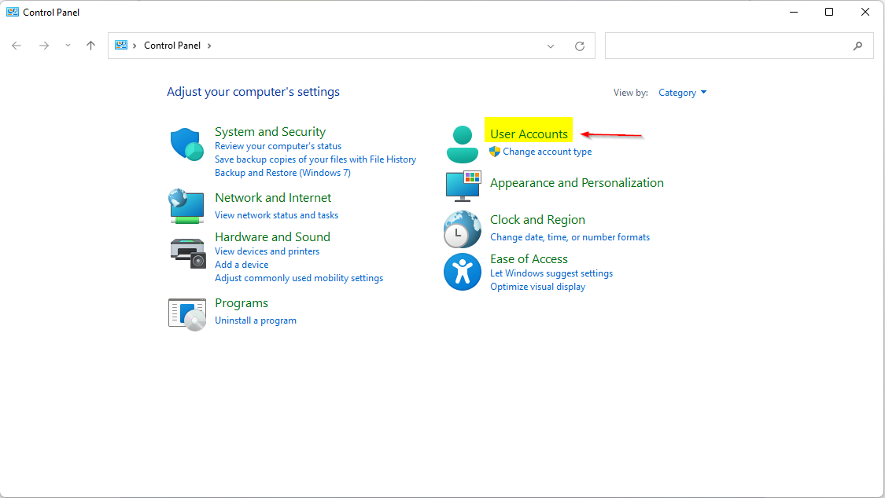

4. Click on "**Mail (Microsoft Outlook)**".

   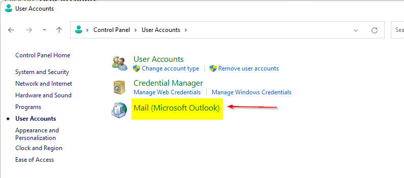

5. Click on "**Email Accounts**".

   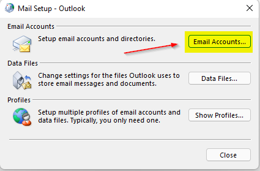

6. Choose the mailbox which have permissions to the additional mailbox and click on "**Change**".

   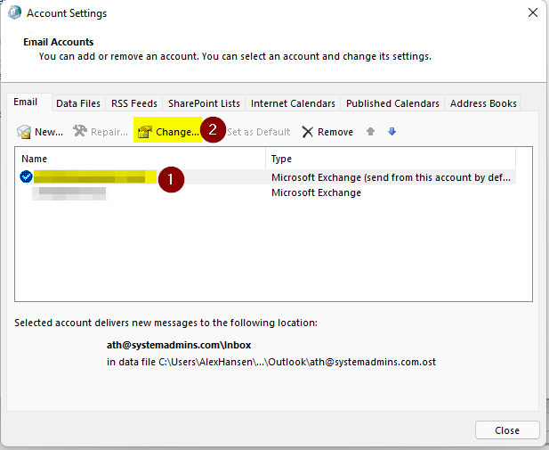

7. Click "**More Settings**".

   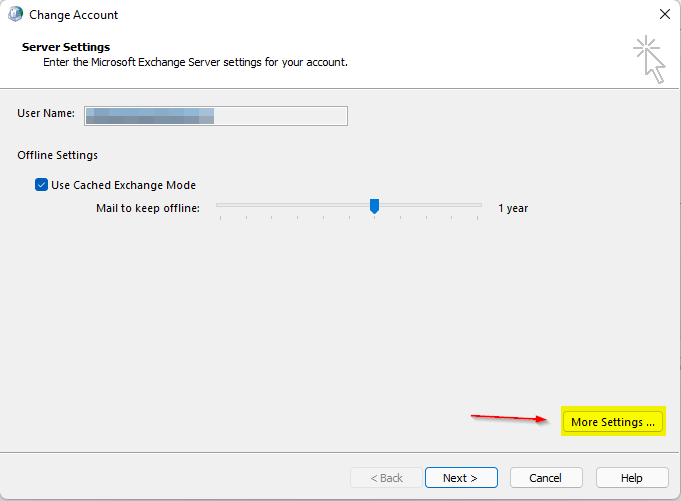

8. Click on the "**Advanced**"-tab and then "**Add**".

   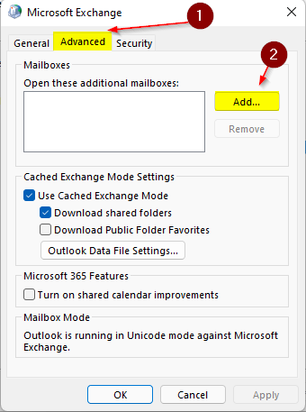

9. Type the e-mail of the mailbox that should be added and then click "**OK**".

   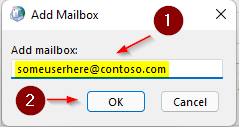

10. The mailbox is now added, click on "**OK**" again.

    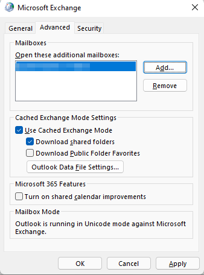

11. Click on "**Next**".

    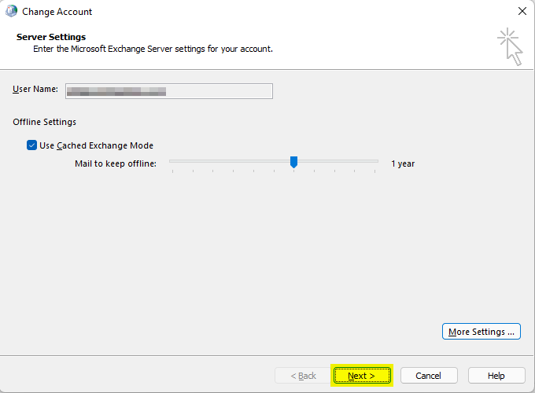

12. Click on "**Finish**".

    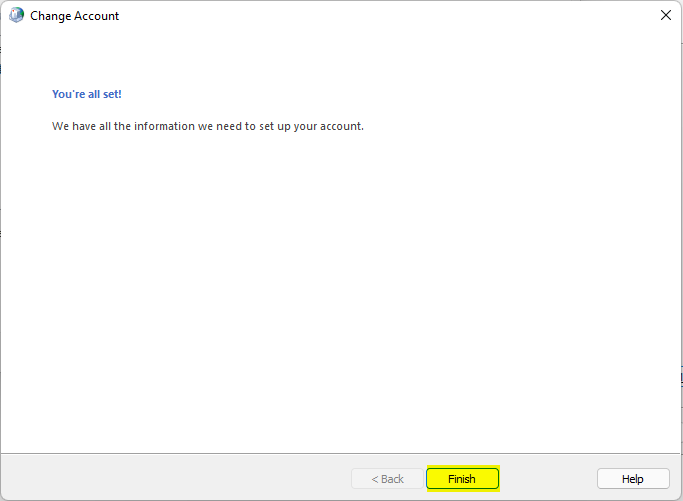

13. Now click on "**Close**".

    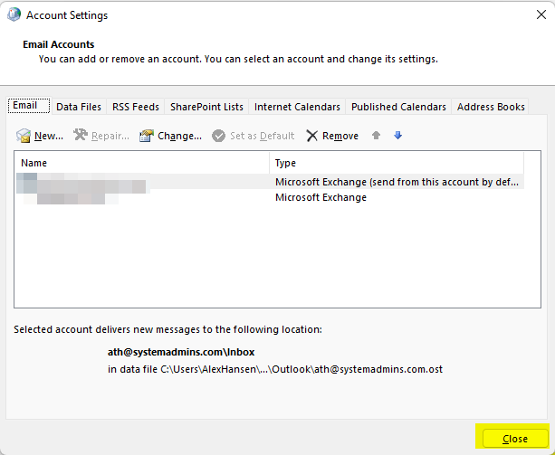

14. Click on "**Close**" again.

    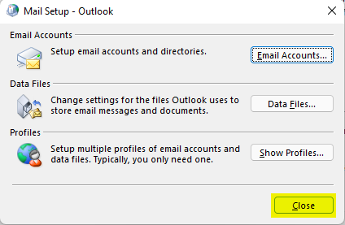
