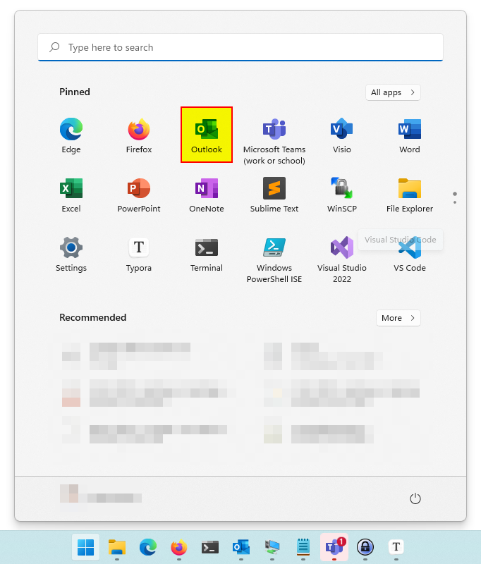
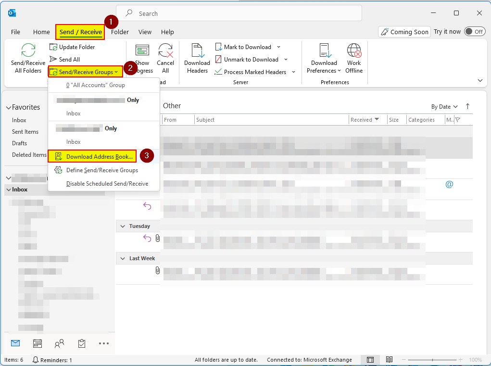
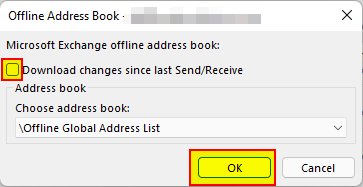
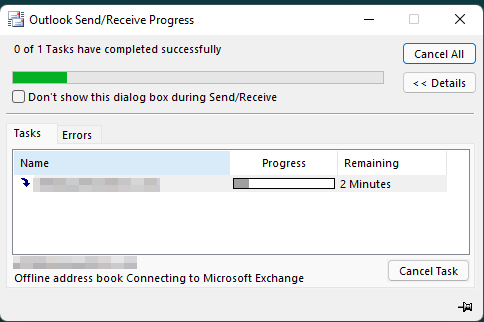

# Update address book in Microsoft Outlook

This will explain how-to update the global address book (cached) in Microsoft Outlook. The following screenshot is from Windows 11 (build 22000.318)

1. Click on "**Start**" (Windows icon) on the desktop.

   

2. Open "**Outlook**".

   

3. In Outlook now click on the "**Send / Receive**" tab, "**Send/Receive Groups**" button and click on "**Download Address Book**".

   

4. Now uncheck "**Download changes since last Send/Receive**" to force an update and then click "**OK**".

   

5. It's now downloading the Offline Address Book from the Exchange servers, it may take a while.

   

